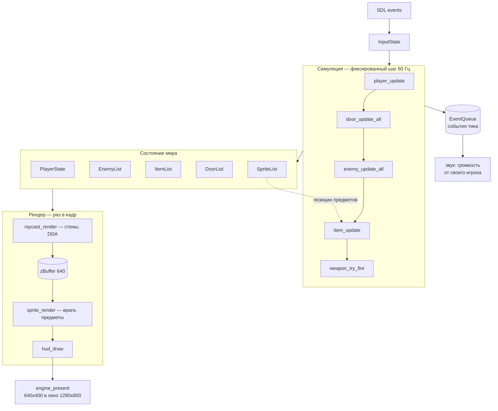

# Устройство игры

Как doom-clone работает **сейчас** и почему сделан именно так. Куда проект
движется — в [roadmap.md](roadmap.md); что делать конкретно — в
[tasks/](tasks/); нефункциональные ограничения — в
[requirements.md](requirements.md).

Сборка, управление, формат карты и структура каталогов описаны в
[../README.md](../README.md) и здесь не повторяются. Ловушки, о которых
стоит знать до правки кода, — в [../CLAUDE.md](../CLAUDE.md).

Игра прошла четыре этапа разработки: базовый движок с raycasting, текстуры
и спрайты, стрельба и ИИ, HUD со звуком и состояниями игры. Всё это
работает; дальше идёт мультиплеер.

## Технологии

| Что | Чем |
|---|---|
| Язык | C11 (gcc / clang / MSVC) |
| Сборка | CMake, кросс-платформенная |
| Графика и ввод | SDL2 |
| Звук | SDL2_mixer |
| Загрузка изображений | stb_image (`vendor/`), сейчас не используется |
| Рендер | программный raycasting (DDA) |

Буфер кадра 640×400 растягивается в окно 1280×800. Ни GPU, ни звуковая
карта не требуются: рендер целиком на CPU, SDL нужен только чтобы показать
готовый кадр.

## Как устроен кадр

Сплошные стрелки — обычный поток кадра. Пунктирная — единственное место,
где симуляция зависит от рендера; про него ниже, в «Известных
ограничениях».

## Настройки игры

Источник истины — `src/utils.h`; таблица здесь для ориентира.

| Параметр | Значение |
|---|---|
| FOV | 66° (`FOV_PLANE 0.66` при длине направления 1.0) |
| Скорость движения | 3.0 клетки/с |
| Скорость поворота | 3.0 рад/с |
| Чувствительность мыши | 0.002 рад/px |
| Радиус игрока | 0.2 клетки |
| Шаг симуляции | 60 Гц, фиксированный |
| Размер карты | до 24×24 |

## Рендер

Классический raycasting по мотивам туториала lodev. На каждый из 640
экранных столбцов выпускается луч, DDA идёт по сетке карты до первой стены
или закрытой двери, дальше столбец текстурируется по вертикали.

Сам DDA живёт отдельно от рендера — `raycast_walls()` в
`raycast_world.c`, который не знает ни про экран, ни про SDL и возвращает
`RayHit` с перпендикулярной дистанцией, точкой попадания, гранью и клеткой.
`raycast_render()` отвечает только за текстурирование, затенение сторон и
`zBuffer`. Той же трассировкой ИИ проверяет линию видимости.

Три вещи, которые здесь принципиальны:

1. **Коррекция «рыбьего глаза».** Расстояние берётся перпендикулярное
   (`perpWallDist`), а не евклидово до точки попадания. С евклидовым стены
   выгибаются к краям экрана.
2. **Z-буфер обязателен.** `float zBuffer[SCREEN_W]` заполняется при
   отрисовке стен и проверяется по столбцам при отрисовке спрайтов —
   иначе спрайты рисуются поверх стен, за которыми стоят.
3. **Спрайты сортируются от дальних к ближним** и рисуются в этом порядке,
   чтобы ближние перекрывали дальние.

Текстуры и спрайты генерируются процедурно в `assets.c`, звуки
синтезируются в `audio.c` как WAV в памяти. Часть слотов после генераторов
перекрывается файлами: `assets_init()` идёт по таблице и подставляет лист
кадров из `assets/` через `assets_load_sheet()`. Отсутствующий файл —
штатное состояние, слот остаётся процедурным.

`Texture` поэтому хранит не одну картинку, а сетку кадров: `fw`/`fh` —
размер кадра, `cols`/`rows` — сколько их, шаг строки равен ширине всего
листа. Процедурная текстура — это один кадр. Звук файлами не заменяется.

## Симуляция

Игровой цикл — фиксированный шаг с аккумулятором: логика считается строго
на 60 Гц, рендер происходит раз в кадр. Без этого поведение физики
зависело бы от FPS: на быстрой машине игрок двигался бы быстрее.

Коллизии проверяются раздельно по X и по Y. Это и есть скольжение вдоль
стены: упершись в стену под углом, игрок продолжает двигаться вдоль неё,
а не залипает.

Направление взгляда хранится одним углом в радианах, свёрнутым в `[-π, π]`.
Базис камеры — `dir` и `plane` — выводится из него функцией
`player_camera()` (`camera.h`) на месте и в состоянии не лежит: длина
`plane` задаёт поле зрения, то есть это величина рендера. Угол выбран не
ради экономии: пару векторов нельзя корректно интерполировать между
снапшотами, а угол интерполируется по кратчайшей дуге.

ИИ врага — конечный автомат `IDLE → ALERT → CHASE → ATTACK → DEAD`.
Преследование идёт по прямой, видимость проверяется честным DDA
(`world_line_of_sight()`), поэтому углы стен не простреливаются. Поиска пути
нет намеренно: на одной карте 24×24 с редкими препятствиями A* даёт
неотличимый результат при заметно большей сложности.

Потеряв игрока из виду, враг идёт не на его текущую позицию, а на
последнюю виденную (`last_seen_x/y`), и через `ENEMY_SEARCH_TIME` или по
приходе в эту точку возвращается в `IDLE` — так от преследования можно
оторваться, разорвав линию видимости.

Стрельба — хитскан в мировых координатах. `world_raycast()`
(`raycast_world.c`) пускает по лучу на дробину из позиции стрелка вдоль его
угла, берёт дистанцию до стены или закрытой двери из `raycast_walls()` и
пересекает луч с окружностями живых врагов и игроков
(`ENEMY_HIT_RADIUS`, `PLAYER_HIT_RADIUS`), отбрасывая всё, что дальше
стены или позади начала луча; побеждает ближайшее попадание. Ни камера, ни
экран, ни отрисованный кадр в расчёте не участвуют, поэтому выстрел
считается и там, где рисовать нечем. Стрелок исключается из трассировки —
луч начинается внутри его собственного радиуса. Урон игроку наносит
`player_damage()` (`player.c`): броня поглощает половину, остаток идёт в
hp, а стрелок запоминается в `last_attacker` для атрибуции фрага.

Звук симуляция не проигрывает. Всё, на что нужно среагировать снаружи —
выстрел, отсутствие патронов, попадание, смерть, подбор, дверь, — она
складывает в `EventQueue` (`event.h`) записями
`GameEvent { kind, actor, x, y }`, а клиент разбирает очередь после тика и
считает громкость по дистанции от **своего** игрока. Поэтому `enemy.c`,
`weapon.c`, `item.c` и `door.c` собираются вообще без SDL. Очередь
ограничена `MAX_EVENTS`, переполнение молча теряет событие: потерянный звук
не должен менять симуляцию. Та же запись поедет в снапшоте на этапе 7.

## Модель сущностей

Все списки — массивы фиксированного размера со счётчиком, из которых
ничего не удаляется: предмет после подбора деактивируется, враг после
смерти переходит в `ESTATE_DEAD` и превращается в труп. Поэтому индекс в
массиве — стабильный идентификатор, и отдельная система id не нужна.

## Известные ограничения

Одно место, где рендер и симуляция срослись сильнее, чем следует:

- `SpriteList` служит источником истины для позиций предметов, хотя должен
  быть чисто рендерным списком.

В одиночной игре это работает и никому не мешает. Серверной симуляции,
которой нечего рисовать, взять позиции предметов будет неоткуда — разбор и
план развязки в [roadmap.md](roadmap.md).

## Ресурсы

- **Lode's Computer Graphics Tutorial — Raycasting** (lodev.org) —
  референс, по которому построен рендер
- **SDL2 documentation** — wiki.libsdl.org
- **stb_image.h** — загрузка изображений одним заголовком
- Исходники оригинального Doom (id Software) — для архитектурных идей
